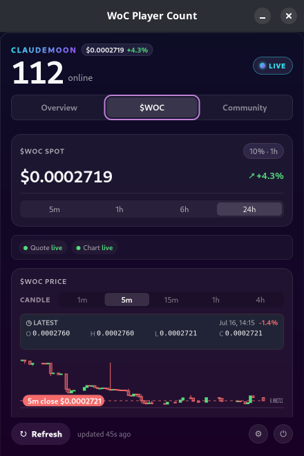

# WoC Player Count — a Linux panel and tray companion for World of ClaudeCraft

[](https://github.com/FernandoX7/woc-widget-linux/actions/workflows/ci.yml)
[](LICENSE)
[](https://kernel.org/)

WoC Player Count is an independent, open-source Linux companion for
[World of ClaudeCraft](https://worldofclaudecraft.com). It combines live player count and realm
status, local population history, a `$WOC` quote and OHLCV candle chart, community information,
and configurable alerts in a focused dashboard. Linux users can choose a native COSMIC panel
applet or the cross-desktop StatusNotifierItem tray application.

> **Independent community project.** WoC Player Count is not affiliated with or endorsed by World
> of ClaudeCraft, Dream Home AI Limited, or Levy Street. It never asks for game credentials or a
> wallet connection.

> **Beta distribution.** Debian and AppImage downloads are available from
> [GitHub Releases](https://github.com/FernandoX7/woc-widget-linux/releases). The first packages
> target Ubuntu and Pop!_OS; other desktops remain best effort. `$WOC` information is
> informational, may be delayed or incorrect, and is not financial advice.



[Play World of ClaudeCraft](https://worldofclaudecraft.com) ·
[macOS version](https://github.com/FernandoX7/woc-widget) · [Installation](docs/INSTALL.md)

## Features

- **Honest feed provenance:** live, cached, loading, and unavailable values remain distinct; a
  stale price is never presented as live panel data.
- **Observed population history:** 1h, 6h, 24h, and 7d ranges show truthful gaps and isolated
  observations rather than invented continuity.
- **Integrated `$WOC` data:** validated DEX Screener spot and rolling metrics plus GeckoTerminal
  OHLCV candles.
- **Community view:** project statistics, the latest release, lifetime-XP leaders, realms, and
  useful links; individual feed failures do not blank the page.
- **Configurable alerts:** quiet hours, shared cooldowns, hysteresis, and mute/disable actions for
  realm, population, price, and release events.
- **Local control:** seven-day history is stored only on the device, can be exported as CSV or
  JSON, and can be cleared with its recovery snapshot.
- **No telemetry:** the companion has no account, analytics, advertising, or backend.

## Linux desktop behavior

The tray menu's **Open Dashboard** command is the portable activation path. Panel implementations
decide whether label text and click activation are available.

| Environment | Status | Expected behavior |
| --- | --- | --- |
| Pop!_OS 24.04 COSMIC | Verified locally | Native applet shows the configured live label. The generic tray is suppressed when that applet is detected. |
| COSMIC generic tray | Verified locally | Icon and menu; COSMIC does not activate the dashboard by clicking the tray icon. |
| Ubuntu GNOME + AppIndicator | Expected, unverified | Icon and `XAyatanaLabel`; use the menu or GNOME's desktop-specific activation behavior. |
| Stock GNOME/Fedora | Expected, unverified | Requires the AppIndicator/KStatusNotifierItem extension; label behavior is extension-dependent. |
| KDE Plasma, XFCE, Cinnamon, other SNI hosts | Expected, unverified | Icon and menu; direct-click activation and label display vary by host. |

Wayland prevents reliable panel-relative positioning, so the dashboard is a normal fixed 440×660
window. See [COSMIC integration](docs/COSMIC.md) and the [packaging matrix](docs/PACKAGING.md).

## Installation

Download the Debian package or AppImage from
[GitHub Releases](https://github.com/FernandoX7/woc-widget-linux/releases). These are beta packages;
building from source remains available for developers:

```sh
sudo apt install build-essential curl libwebkit2gtk-4.1-dev \
  libayatana-appindicator3-dev libssl-dev libgtk-3-dev librsvg2-dev \
  libxdo-dev pkg-config
curl --proto '=https' --tlsv1.2 -sSf https://sh.rustup.rs | sh
cd woc-widget-linux/woc-app/ui
npm ci
cd ..
ui/node_modules/.bin/tauri dev
```

The detailed [installation guide](docs/INSTALL.md) covers release verification, source builds,
local Flatpak packaging, the separate unreleased COSMIC applet package, uninstalling, and
preserving or deleting data.

## Dashboard

| Destination | What it shows |
| --- | --- |
| Overview | Realm health, population history, local records, and Realm Rhythm |
| `$WOC` | Spot quote, rolling metrics, candles, provider state, and market alerts |
| Community | Project totals, releases, leaders, realms, and community links |
| Settings | Alerts, refresh intervals, panel label, autostart, export, deletion, and About links |

## Privacy and local data

Native packages and AppImages use:

- Settings: `${XDG_CONFIG_HOME:-$HOME/.config}/woc-widget/settings.json`
- History: `${XDG_DATA_HOME:-$HOME/.local/share}/woc-widget/history.json`
- Recovery snapshot: the same history path with `.backup` appended
- Autostart: `${XDG_CONFIG_HOME:-$HOME/.config}/autostart/io.github.fernandox7.wocplayercount.desktop`

History is retained for seven days and only records observations made while the application runs.
Export writes to a user-selected file. Clear History deletes the primary and backup snapshots.
The app contacts World of ClaudeCraft, DEX Screener, and GeckoTerminal directly; those providers
receive ordinary connection metadata such as an IP address. Read [PRIVACY.md](PRIVACY.md).

## Architecture

- `wockit` — UI-independent services, models, history, analytics, alerts, and formatting.
- `woc-app` — Tauri v2 shell, polling, SNI tray, notifications, persistence, and lifecycle.
- `woc-app/ui` — Svelte 5, Vite, and TypeScript dashboard.
- `woc-cosmic-applet` — native libcosmic panel applet sharing `wockit` policies.

The boundaries and data flow are documented in [docs/ARCHITECTURE.md](docs/ARCHITECTURE.md).

## Development

Run UI commands from `woc-app/ui/` and Rust commands from the repository root:

```sh
cargo fmt --check
cargo clippy --workspace --all-targets -- -D warnings
cargo test --workspace

cd woc-app/ui
npm ci
npm run check
npm run build
npx playwright install --with-deps chromium
npx playwright test

cd ..
ui/node_modules/.bin/tauri dev
```

The Tauri CLI is the UI's locked npm dependency. Run it from `woc-app/`; a plain debug
`woc-widget` binary expects the Vite development URL and is not a standalone production build.
See [docs/DEVELOPMENT.md](docs/DEVELOPMENT.md) for prerequisites and production packaging commands.

## Known boundaries

- History is observed only while the app runs. Missing time is not backfilled.
- Market and community services are best effort; cached data stays explicitly labeled.
- Panel labels, click activation, and notification actions differ between desktops.
- Only local COSMIC behavior is currently live-verified. Other desktop rows remain expectations.
- Beta Debian and AppImage packages are public, but there is no Flathub listing, updater, or
  verified cross-desktop clean-VM matrix yet.

## Contributing, security, and license

Contributions are welcome; start with [CONTRIBUTING.md](CONTRIBUTING.md). Report vulnerabilities
through GitHub's private vulnerability reporting once enabled, as described in
[SECURITY.md](SECURITY.md). Changes are tracked in [CHANGELOG.md](CHANGELOG.md).

The source and original companion artwork are available under the [MIT License](LICENSE). World of
ClaudeCraft, provider names, and third-party data remain their owners' property. See
[CREDITS.md](CREDITS.md) for attribution and the relationship to the
[macOS WoC Player Count](https://github.com/FernandoX7/woc-widget).
